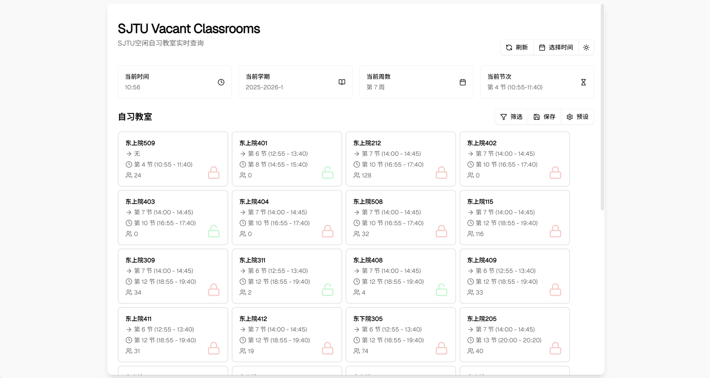

## sjtu-vacant-classrooms

A simple web application to check vacant self-study classrooms for SJTUers.

### Features

- Support both minhang and xuhui campuses.
- Real-time classroom availability updates.
- Filters and presets to quickly check suitable classrooms.
- Responsive design for mobile and desktop users.

### Usage

#### Local Deployment

Clone this repo and run:

```
npm install
npm run dev:cf
```

And visit http://localhost:8788 to use.

#### Deploy to cloudflare

> **Warning**
> You should deploy this repo to **Cloudflare Pages** instead of Workers.

1. Fork this repo.
2. Go to [Cloudflare Dashboard](https://dash.cloudflare.com/).
3. `Compute & AI` >  `Workers & Pages` > `Create Application` > `Pages` > `Import an existing Git repository`
4. Select the repo forked and deploy it.

### Screenshot



### Framework

[React](https://reactjs.org/) + [Vite](https://vitejs.dev/) + [Cloudflare Workers](https://workers.cloudflare.com/) + [Shadcn UI](https://ui.shadcn.com/)