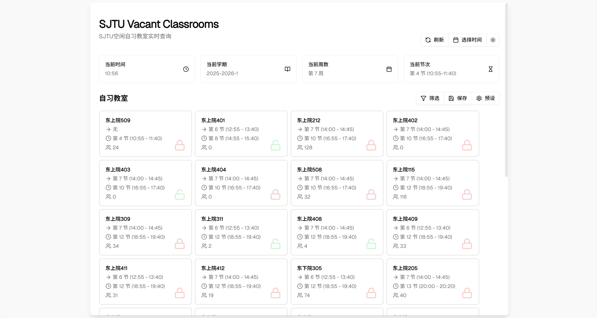

## sjtu-vacant-classrooms

一个给SJTUers用来查询空闲自习教室的简单Web应用。

### 特性

- 支持闵行和徐汇两个校区。
- 实时更新教室空闲情况。
- 过滤器和预设，快速查找合适的教室。
- 响应式设计，适配移动端和桌面端用户。

### 使用方法

#### 本地部署

克隆此仓库并运行：

```
npm install
npm run dev:cf
```

然后访问 http://localhost:8788 使用。

#### 部署到 Cloudflare

> **Warning**
> 应该部署到 **Cloudflare Pages** 而不是 Workers.

1. Fork 这个仓库。
2. 打开 [Cloudflare Dashboard](https://dash.cloudflare.com/).
3. `Compute & AI` >  `Workers & Pages` > `Create Application` > `Pages` > `Import an existing Git repository`
4. 选择刚才克隆的仓库并部署到 Cloudflare Pages.

### 截图


### 框架
[React](https://reactjs.org/) + [Vite](https://vitejs.dev/) + [Cloudflare Workers](https://workers.cloudflare.com/) + [Shadcn UI](https://ui.shadcn.com/)